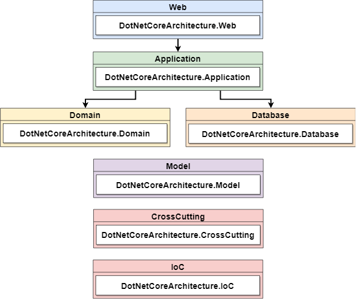
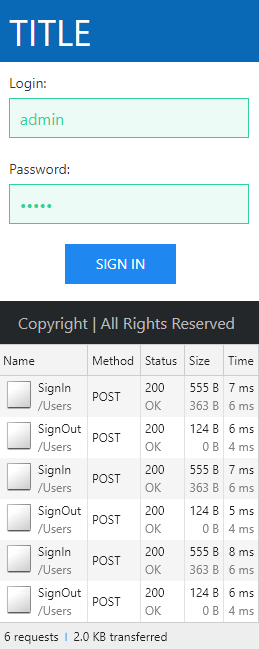
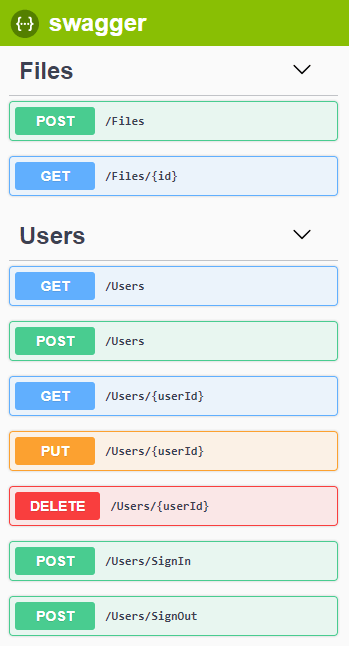

# DotNetCoreArchitecture

This project is an example of architecture with new technologies and best practices.

It is not the perfect or the definitive solution for all contexts.

The goal is to be simple and easy to improve and evolve.

Feel free to fix, improve, and change this architecture as you wish or need.

## Code Analysis

[](https://www.codacy.com/app/rafaelfgx/DotNetCoreArchitecture?utm_source=github.com&amp;utm_medium=referral&amp;utm_content=rafaelfgx/DotNetCoreArchitecture&amp;utm_campaign=Badge_Grade)

## Technologies

* [.NET Core 2.2.2](https://dotnet.microsoft.com/download)
* [ASP.NET Core 2.2.2](https://docs.microsoft.com/en-us/aspnet/core)
* [Entity Framework Core 2.2.2](https://docs.microsoft.com/en-us/ef/core)
* [C# 7.3](https://docs.microsoft.com/en-us/dotnet/csharp)
* [Angular 7.2.5](https://angular.io/docs)
* [Typescript 3.2.4](https://www.typescriptlang.org/docs/home.html)
* [HTML](https://www.w3schools.com/html)
* [CSS](https://www.w3schools.com/css)
* [SASS](https://sass-lang.com)
* [UIkit](https://getuikit.com/docs/introduction)
* [JWT](https://jwt.io)
* [Swagger](https://swagger.io)
* [Docker](https://docs.docker.com)

## Practices

* Clean Code
* Code Analysis
* DDD (Domain-Driven Design)
* SOLID Principles
* Ubiquitous Language
* Dependency Injection
* Logging
* Object Mapping
* Response Compression
* Response Caching

## Tools

* [Visual Studio 2017](https://visualstudio.microsoft.com/vs)
* [Visual Studio Code](https://code.visualstudio.com)
* [SQL Server 2017](https://www.microsoft.com/en-us/sql-server/sql-server-downloads)
* [Postman](https://www.getpostman.com)

## Visual Studio Extensions

* [CodeMaid](https://marketplace.visualstudio.com/items?itemName=SteveCadwallader.CodeMaid)
* [Roslynator](https://marketplace.visualstudio.com/items?itemName=josefpihrt.Roslynator2017)
* [SonarLint](https://marketplace.visualstudio.com/items?itemName=SonarSource.SonarLintforVisualStudio2017)
* [TSLint](https://marketplace.visualstudio.com/items?itemName=vladeck.TSLint)

## Recommended Books

* **Clean Code: A Handbook of Agile Software Craftsmanship** - Robert C. Martin (Uncle Bob)
* **Clean Architecture: A Craftsman's Guide to Software Structure and Design** - Robert C. Martin (Uncle Bob)
* **Domain-Driven Design: Tackling Complexity in the Heart of Software** - Eric Evans
* **Domain-Driven Design Reference: Definitions and Pattern Summaries** - Eric Evans
* **Implementing Domain-Driven Design** - Vaughn Vernon
* **Domain-Driven Design Distilled** - Vaughn Vernon

## Layers and Projects



**Web:** This layer contains the api (ASP.NET Core) and the frontend (Angular).

**Application:** This layer is responsible for flow control. It does not contain business rules.

**Domain:** This layer contains the business rules and the domain logic.

**Database:** This layer isolates and abstracts the data persistence.

**Model:** This layer is responsible for modeling objects such as entities, models and enums.

**CrossCutting:** This layer provides generic features for other layers.

**IoC:** This layer provides inversion of control registering services.

## Nuget Packages

In order for this project to be as clean as possible of common functionality to many projects, Nuget packages were created for this purpose.

**Source:** [https://github.com/rafaelfgx/DotNetCore](https://github.com/rafaelfgx/DotNetCore)

**Published:** [https://www.nuget.org/profiles/rafaelfgx](https://www.nuget.org/profiles/rafaelfgx)

## ASP.NET Core Startup

The **Startup** class is responsible for configuring the application's pipeline.

```csharp
public class Startup
{
    public Startup(IHostingEnvironment environment)
    {
        Configuration = environment.Configuration();
        Environment = environment;
    }

    private IConfiguration Configuration { get; }

    private IHostingEnvironment Environment { get; }

    public void Configure(IApplicationBuilder application)
    {
        application.UseExceptionDefault(Environment);
        application.UseCorsDefault();
        application.UseHstsDefault(Environment);
        application.UseHttpsRedirection();
        application.UseAuthentication();
        application.UseResponseCompression();
        application.UseResponseCaching();
        application.UseStaticFiles();
        application.UseMvcWithDefaultRoute();
        application.UseHealthChecks("/healthz");
        application.UseSwaggerDefault("api");
        application.UseSpaStaticFiles();
        application.UseSpaAngularServer(Environment, "Frontend", "serve");
    }

    public void ConfigureServices(IServiceCollection services)
    {
        services.AddDependencyInjection(Configuration);
        services.AddCors();
        services.AddAuthenticationDefault();
        services.AddResponseCompression();
        services.AddResponseCaching();
        services.AddMvcDefault();
        services.AddHealthChecks();
        services.AddSwaggerDefault("api");
        services.AddSpaStaticFiles("Frontend/dist");
    }
}
```

## ASP.NET Core Controller

The **Controller** class is responsible for receiving and responding to requests.

```csharp
[ApiController]
[RouteController]
public class UsersController : ControllerBase
{
    public UsersController(IUserService userService)
    {
        UserService = userService;
    }

    private IUserService UserService { get; }

    [HttpPost]
    public Task<IDataResult<long>> AddAsync(AddUserModel addUserModel)
    {
        return UserService.AddAsync(addUserModel);
    }

    [HttpDelete("{userId}")]
    public Task<IResult> DeleteAsync(long userId)
    {
        return UserService.DeleteAsync(userId);
    }

    [HttpGet]
    public Task<IEnumerable<UserModel>> ListAsync()
    {
        return UserService.ListAsync();
    }

    [HttpGet("{userId}")]
    public Task<UserModel> SelectAsync(long userId)
    {
        return UserService.SelectAsync(userId);
    }

    [AllowAnonymous]
    [HttpPost("[action]")]
    public IActionResult SignIn(SignInModel signInModel)
    {
        return new DataResult(UserService.SignInAsync(signInModel).Result);
    }

    [HttpPost("SignOut")]
    public Task SignOutAsync()
    {
        return UserService.SignOutAsync(new SignOutModel(User.Id()));
    }

    [HttpPut("{userId}")]
    public Task<IResult> UpdateAsync(long userId, UpdateUserModel updateUserModel)
    {
        updateUserModel.UserId = userId;

        return UserService.UpdateAsync(updateUserModel);
    }
}
```

## Service

The **Service** class is responsible for flow control. It uses validator, factory, domain and repository, but does not contain business rules.

```csharp
public sealed class UserService : IUserService
{
    public UserService
    (
        IDatabaseUnitOfWork databaseUnitOfWork,
        IJsonWebToken jsonWebToken,
        IUserLogService userLogService,
        IUserRepository userRepository
    )
    {
        DatabaseUnitOfWork = databaseUnitOfWork;
        JsonWebToken = jsonWebToken;
        UserLogService = userLogService;
        UserRepository = userRepository;
    }

    private IDatabaseUnitOfWork DatabaseUnitOfWork { get; }

    private IJsonWebToken JsonWebToken { get; }

    private IUserLogService UserLogService { get; }

    private IUserRepository UserRepository { get; }

    public async Task<IDataResult<long>> AddAsync(AddUserModel addUserModel)
    {
        var validation = new AddUserModelValidator().Valid(addUserModel);

        if (!validation.Success)
        {
            return new ErrorDataResult<long>(validation.Message);
        }

        var userDomain = UserDomainFactory.Create(addUserModel);

        userDomain.Add();

        var userEntity = userDomain.Map<UserEntity>();

        await UserRepository.AddAsync(userEntity).ConfigureAwait(false);

        await DatabaseUnitOfWork.SaveChangesAsync().ConfigureAwait(false);

        return new SuccessDataResult<long>(userEntity.UserId);
    }

    public async Task<IResult> DeleteAsync(long userId)
    {
        await UserRepository.DeleteAsync(userId).ConfigureAwait(false);

        await DatabaseUnitOfWork.SaveChangesAsync().ConfigureAwait(false);

        return new SuccessResult();
    }

    public async Task<PagedList<UserModel>> ListAsync(PagedListParameters parameters)
    {
        return await UserRepository.ListAsync<UserModel>(parameters).ConfigureAwait(false);
    }

    public async Task<IEnumerable<UserModel>> ListAsync()
    {
        return await UserRepository.ListAsync<UserModel>().ConfigureAwait(false);
    }

    public async Task<UserModel> SelectAsync(long userId)
    {
        return await UserRepository.SelectAsync<UserModel>(userId).ConfigureAwait(false);
    }

    public async Task<IDataResult<TokenModel>> SignInAsync(SignInModel signInModel)
    {
        var validation = new SignInModelValidator().Valid(signInModel);

        if (!validation.Success)
        {
            return new ErrorDataResult<TokenModel>(validation.Message);
        }

        var userDomain = UserDomainFactory.Create(signInModel);

        userDomain.SignIn();

        signInModel = userDomain.Map<SignInModel>();

        var signedInModel = await UserRepository.SignInAsync(signInModel).ConfigureAwait(false);

        validation = new SignedInModelValidator().Valid(signedInModel);

        if (!validation.Success)
        {
            return new ErrorDataResult<TokenModel>(validation.Message);
        }

        await AddUserLogAsync(signedInModel.UserId, LogType.SignIn).ConfigureAwait(false);

        var tokenModel = CreateJsonWebToken(signedInModel);

        return new SuccessDataResult<TokenModel>(tokenModel);
    }

    public async Task SignOutAsync(SignOutModel signOutModel)
    {
        await AddUserLogAsync(signOutModel.UserId, LogType.SignOut).ConfigureAwait(false);
    }

    public async Task<IResult> UpdateAsync(UpdateUserModel updateUserModel)
    {
        var validation = new UpdateUserModelValidator().Valid(updateUserModel);

        if (!validation.Success)
        {
            return new ErrorResult(validation.Message);
        }

        var userEntityDatabase = await UserRepository.SelectAsync(updateUserModel.UserId).ConfigureAwait(false);

        var userDomain = UserDomainFactory.Create(updateUserModel);

        userDomain.SetLogin(userEntityDatabase.Login);

        userDomain.SetPassword(userEntityDatabase.Password);

        var userEntity = userDomain.Map<UserEntity>();

        await UserRepository.UpdateAsync(userEntity, userEntity.UserId).ConfigureAwait(false);

        await DatabaseUnitOfWork.SaveChangesAsync().ConfigureAwait(false);

        return new SuccessResult();
    }

    private async Task AddUserLogAsync(long userId, LogType logType)
    {
        var userLogModel = new UserLogModel(userId, logType);

        await UserLogService.AddAsync(userLogModel).ConfigureAwait(false);
    }

    private TokenModel CreateJsonWebToken(SignedInModel signedInModel)
    {
        var sub = signedInModel.UserId.ToString();

        var roles = signedInModel.Roles.ToString().Split(", ");

        var token = JsonWebToken.Encode(sub, roles);

        return new TokenModel(token);
    }
}
```

## Domain

The **Domain** class is responsible for business rules and domain logic. It does not depend on any framework or other layers.

```csharp
public sealed class UserDomain
{
    public UserDomain
    (
        long userId,
        string name,
        string surname,
        string email,
        string login,
        string password,
        Roles roles
    )
    {
        UserId = userId;
        Name = name;
        Surname = surname;
        Email = email;
        Login = login;
        Password = password;
        Roles = roles;
    }

    public UserDomain(string login, string password)
    {
        Login = login;
        Password = password;
    }

    public string Email { get; private set; }

    public string Login { get; private set; }

    public string Name { get; private set; }

    public string Password { get; private set; }

    public Roles Roles { get; set; }

    public Status Status { get; set; }

    public string Surname { get; private set; }

    public long UserId { get; private set; }

    public void Add()
    {
        Roles = Roles.User;
        Status = Status.Active;
        CreateLoginPasswordHash();
    }

    public void SetLogin(string login)
    {
        Login = login;
    }

    public void SetPassword(string password)
    {
        Password = password;
    }

    public void SignIn()
    {
        CreateLoginPasswordHash();
    }

    private void CreateLoginPasswordHash()
    {
        Login = UserDomainService.CreateHash(Login);
        Password = UserDomainService.CreateHash(Password);
    }
}
```

## Domain Factory

The **Factory** class is responsible for creating an object.

```csharp
public static class UserDomainFactory
{
    public static UserDomain Create(AddUserModel addUserModel)
    {
        return new UserDomain
        (
            addUserModel.UserId,
            addUserModel.Name,
            addUserModel.Surname,
            addUserModel.Email,
            addUserModel.Login,
            addUserModel.Password,
            addUserModel.Roles
        );
    }

    public static UserDomain Create(UpdateUserModel updateUserModel)
    {
        return new UserDomain
        (
            updateUserModel.UserId,
            updateUserModel.Name,
            updateUserModel.Surname,
            updateUserModel.Email,
            null,
            null,
            updateUserModel.Roles
        );
    }

    public static UserDomain Create(SignInModel signInModel)
    {
        return new UserDomain(signInModel.Login, signInModel.Password);
    }
}
```

## Domain Service

The **Domain Service** class is responsible for encapsulating business logic that doesn't fit within the domain object.

```csharp
public static class UserDomainService
{
    public static string CreateHash(string text)
    {
        return new Hash().Create(text);
    }
}
```

## Model

The **Model** class is responsible for containing a set of data.

```csharp
public class SignedInModel
{
    public long UserId { get; set; }

    public Roles Roles { get; set; }
}
```

## Validator

The **Validator** class is responsible for validating an object with defined rules.

```csharp
public sealed class SignedInModelValidator : Validator<SignedInModel>
{
    public SignedInModelValidator()
    {
        RuleFor(x => x).NotNull();
        RuleFor(x => x.UserId).NotNull().NotEmpty().GreaterThan(0);
        RuleFor(x => x.Roles).NotNull().NotEmpty().NotEqual(Roles.None);
    }
}
```

## DbContext

The **DbContext** class is responsible for configuring and mapping the entities in the database.

```csharp
public sealed class DatabaseContext : DbContext
{
    public DatabaseContext(DbContextOptions options) : base(options) { }

    protected override void OnModelCreating(ModelBuilder modelBuilder)
    {
        modelBuilder.ApplyConfigurationsFromAssembly();
    }
}
```

## Entity

The **Entity** class is responsible for containing properties that are mapped to a database table.

```csharp
public class UserEntity
{
    public long UserId { get; set; }

    public string Name { get; set; }

    public string Surname { get; set; }

    public string Email { get; set; }

    public string Login { get; set; }

    public string Password { get; set; }

    public Roles Roles { get; set; }

    public Status Status { get; set; }

    public virtual ICollection<UserLogEntity> UsersLogs { get; set; } = new HashSet<UserLogEntity>();
}
```

## Entity Type Configuration

The **Entity Type Configuration** class is responsible for configuring and mapping the entity to a table.

```csharp
public sealed class UserEntityConfiguration : IEntityTypeConfiguration<UserEntity>
{
    public void Configure(EntityTypeBuilder<UserEntity> builder)
    {
        builder.ToTable("Users", "User");

        builder.HasKey(x => x.UserId);

        builder.HasIndex(x => x.Email).IsUnique();
        builder.HasIndex(x => x.Login).IsUnique();

        builder.Property(x => x.UserId).IsRequired().ValueGeneratedOnAdd();
        builder.Property(x => x.Name).IsRequired().HasMaxLength(100);
        builder.Property(x => x.Surname).IsRequired().HasMaxLength(200);
        builder.Property(x => x.Email).IsRequired().HasMaxLength(300);
        builder.Property(x => x.Login).IsRequired().HasMaxLength(100);
        builder.Property(x => x.Password).IsRequired().HasMaxLength(500);
        builder.Property(x => x.Roles).IsRequired();
        builder.Property(x => x.Status).IsRequired();

        builder.HasMany(x => x.UsersLogs).WithOne(x => x.User).HasForeignKey(x => x.UserId);
    }
}
```

## Repository

The **Repository** class is responsible for abstracting and isolating data persistence.

```csharp
public sealed class UserRepository : EntityFrameworkCoreRepository<UserEntity>, IUserRepository
{
    public UserRepository(DatabaseContext context) : base(context) { }

    public Task<SignedInModel> SignInAsync(SignInModel signInModel)
    {
        return FirstOrDefaultAsync<SignedInModel>
        (
            userEntity => userEntity.Login.Equals(signInModel.Login)
            && userEntity.Password.Equals(signInModel.Password)
            && userEntity.Status == Status.Active
        );
    }
}
```

## Dependency Injection

The **ServiceCollectionExtensions** class is responsible for registering and configuring services.

```csharp
public static class ServiceCollectionExtensions
{
    public static void AddDependencyInjection(this IServiceCollection services, IConfiguration configuration)
    {
        services.AddHash();
        services.AddLogger(configuration);
        services.AddJsonWebToken(Guid.NewGuid().ToString(), TimeSpan.FromHours(12));

        services.AddDbContextEnsureCreatedMigrate<DatabaseContext>(options => options
            .UseSqlServer(configuration.GetConnectionString(nameof(DatabaseContext)))
            .ConfigureWarnings(warnings => warnings.Throw(RelationalEventId.QueryClientEvaluationWarning))
        );

        services.AddClassesMatchingInterfacesFrom
        (
            typeof(IUserService).Assembly,
            typeof(IDatabaseUnitOfWork).Assembly
        );
    }
}
```

## Angular Guard

The **Guard** class is responsible for the security of routes.

```typescript
@Injectable()
export class AppGuard implements CanActivate {
    constructor(
        private readonly router: Router,
        private readonly appTokenService: AppTokenService) { }

    canActivate() {
        if (this.appTokenService.any()) { return true; }
        this.router.navigate(["/login"]);
        return false;
    }
}
```

## Angular Error Handler

The **Error Handler** class is responsible for centralizing the management of all errors and exceptions.

```typescript
@Injectable()
export class AppErrorHandler implements ErrorHandler {
    constructor(private readonly injector: Injector) { }

    handleError(error: any) {
        if (!error.status) { return; }

        switch (error.status) {
            case 401: {
                const router = this.injector.get(Router);
                router.navigate(["/login"]);
                break;
            }
            case 422: {
                const appModalService = this.injector.get(AppModalService);
                appModalService.alert(error.error);
                break;
            }
            default: {
                console.error(error);
                break;
            }
        }
    }
}
```

## Angular HTTP Interceptor

The **Http Interceptor** class is responsible for intercepting the request and the response to perform some logic, such as adding the JWT token in the header for every request.

```typescript
@Injectable()
export class AppHttpInterceptor implements HttpInterceptor {
    constructor(private readonly appTokenService: AppTokenService) { }

    intercept(request: HttpRequest<any>, next: HttpHandler) {
        request = request.clone({
            setHeaders: { Authorization: `Bearer ${this.appTokenService.get()}` }
        });

        return next.handle(request);
    }
}
```

## Angular Service

The **Service** class is responsible for accessing api or containing logic that does not belong to a component.

```typescript
@Injectable({ providedIn: "root" })
export class AppUserService {
    constructor(private readonly http: HttpClient) { }

    add(userModel: UserModel) {
        return this.http.post(`Users`, userModel);
    }

    delete(userId: number) {
        return this.http.delete(`Users/${userId}`);
    }

    list() {
        return this.http.get(`Users`);
    }

    select(userId: number) {
        return this.http.get(`Users/${userId}`);
    }

    update(userModel: UserModel) {
        return this.http.put(`Users/${userModel.userId}`, userModel);
    }
}
```

## Angular Component

The **Component** class is responsible for being a part of the application.

```typescript
@Component({ selector: "app-login", templateUrl: "./login.component.html" })
export class AppLoginComponent {
    signInModel = new SignInModel();

    constructor(private readonly appAuthenticationService: AppAuthenticationService) { }

    ngSubmit() {
        this.appAuthenticationService.signIn(this.signInModel);
    }
}
```

## Performance



## Specifications

**Processor:** Intel Core I7 8700K Coffee Lake 8th-generation.

**Memory:** 16GB 2400Mhz DDR4.

**Storage:** Samsung Evo 960 SSD M2 250gb.

**OS:** Windows 10 Pro 64 bits.

**Web Server:** Kestrel.

**Database:** SQL Server 2017 Developer Edition.

## Swagger



## Run Command Line

1. Install latest [.NET Core SDK](https://aka.ms/dotnet-download).

2. Open directory **source\Web\Frontend** in command line and execute **npm run restore**.

3. Open directory **source\Web** in command line and execute **dotnet run**.

4. Open <https://localhost:8090>.

## Run Visual Studio Code

1. Install latest [.NET Core SDK](https://aka.ms/dotnet-download).

2. Install [C# Extension](https://marketplace.visualstudio.com/items?itemName=ms-vscode.csharp).

3. Open directory **source\Web\Frontend** in command line and execute **npm run restore**.

4. Open **source** directory in Visual Studio Code.

5. Press **F5**.

## Run Visual Studio 2017

1. Install latest [.NET Core SDK](https://aka.ms/dotnet-download).

2. Open directory **source\Web\Frontend** in command line and execute **npm run restore**.

3. Open **source\DotNetCoreArchitecture.sln** in Visual Studio.

4. Set **DotNetCoreArchitecture.Web** as startup project.

5. Press **F5**.

## Run Docker

1. Install and configure [Docker](https://www.docker.com/get-started).

2. Execute **docker-compose up --build -d --force-recreate** in root directory.

3. Open <http://localhost:8095>.
